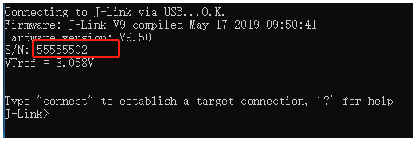

# JLinK刷固件教程
解决市面上购买到的盗版jlink使用Ozone时的报错问题（采用重刷固件及添加License的方式）

* ***需要准备一个能正常使用的jlink(提示盗版的也可以)***

## jlink刷固件及解决报错克隆问题

1.首先将jlink与被刷入的jlink连接

.jpg)

3.3 -> 3.3

GND -> GND

SWCLK ->C

SWDIO ->D

### 2.然后打开SEGGER . J-Link v7.22b文件夹中的J-Flash Lite v7.22b
  
 .png)

device是你的jlink中间的芯片的型号，我的是stm32f103。其他的与图片上一致即可，按OK进入烧写。

### 3.第一步点击红色箭头处的三个点，选择jlink固件/OB-STM32_V754_Addr-0x8000000_Change date to  to 30-02-02(Licensed-CBT6-128K_USE).hex

>0B-STN32 V754 Addr-ox000000 _Change date to to 30-02-02（Licensed-CBT6-128K_USE）.hex  支持的是128KB的MCU

>/jlink固件/JLink_ARM_OB-64KB.hex 支持的是64KB的MCU

**根据MCU选择固件**

第二步点击黄色箭头的erase Chip（擦除芯片的flash）

第三步点击黑色箭头的program device （烧写固件）

.png)

### 4.烧写完成后打开jlink制固件教程（解诀报错盗版克隆）\SEGGER - J-Link v7.22b\J-Link Comander v7.22b

首次打开S/N可能为-1，这时就需要修改S/N.

打开jlink刷固件教程（解决报错盗版克隆）\JLink_v61zjJLink.exe

输入图中命令即可修改，建议S/N为八位数       

.png)

### 5.最后就是输入license

.jpg)

# JLink提取固件教程

先自行查阅 
>jlink固件/jlink ob最新固件提取_jlink ob v2 更新固件-CSDN博客 (2025_3_5 19：51：38).html

***详细教程待完善***